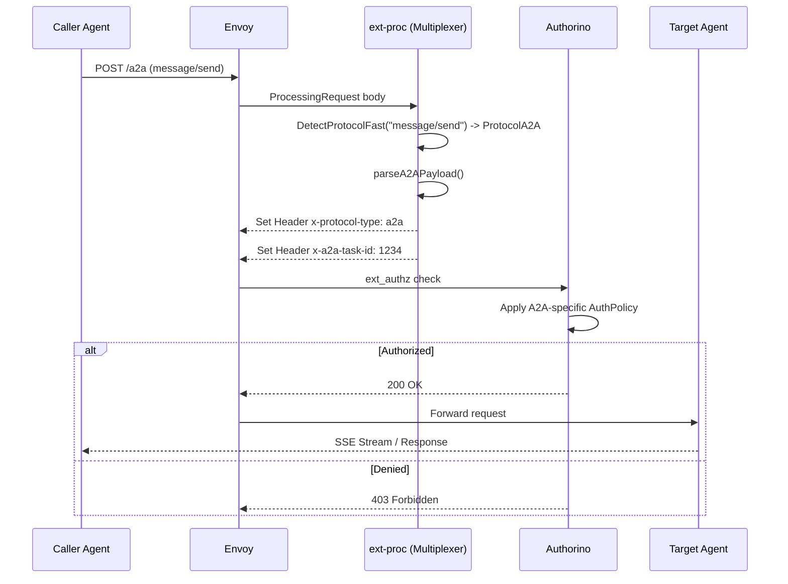

# A2A Protocol Gateway Research

> **Note:** Hey! This repo is just a scratchpad for my initial thoughts and architecture notes on the A2A gateway integration (LFX Issue #766). It's definitely not a finished design doc by any means—just a place for me to map out how the protocol multiplexer and agent card federation might actually look in code before diving into the deep research during the mentorship!

## 1. Architectural Strategy

To support A2A alongside MCP, the core `ext-proc` router must act as a **Protocol Multiplexer**. Rather than building an entirely new processing pipeline, we extend the JSON-RPC parser to branch early based on the JSON-RPC method, separating A2A concerns from MCP concerns.

```text
internal/
├── mcp-router/           # Existing ext-proc (currently MCP-only)
│   ├── extproc.go        # ← Extend: detect A2A methods alongside MCP
│   └── methods.go        # ← New: unified method registry for both protocols
├── a2a/
│   ├── agent_card.go     # Agent card fetching and federation
│   ├── task_tracker.go   # Task state tracking implications
│   └── types.go          # A2A protocol types (AgentCard, Task, etc.)
api/
├── v1alpha1/
│   └── a2a_agent_registration_types.go  # New CRD for A2A endpoints
```

## 2. Protocol Discrimination (The Multiplexer)

Modifying the JSON-RPC parser to handle A2A must not introduce latency to existing MCP traffic. A static `MethodRegistry` allows `O(1)` branching.

```go
// internal/mcp-router/registry.go
package router

type Protocol string

const (
    ProtocolMCP     Protocol = "mcp"
    ProtocolA2A     Protocol = "a2a"
    ProtocolUnknown Protocol = "unknown"
)

var MethodRegistry = map[string]Protocol{
    "tools/call":                 ProtocolMCP,
    "message/send":               ProtocolA2A,
    "tasks/get":                  ProtocolA2A,
    "tasks/pushNotification/set": ProtocolA2A,
}

func DetectProtocolFast(method string) Protocol {
    if p, ok := MethodRegistry[method]; ok {
        return p
    }
    return ProtocolUnknown
}
```

Once the protocol is detected, the payload is parsed and the gateway emits A2A-specific headers (e.g., `x-a2a-task-id`, `x-a2a-skill`) for downstream evaluation by Authorino.

```go
// internal/mcp-router/extproc.go (Proposed Extension)
func parseA2APayload(body []byte, method string, headers map[string]string) map[string]string {
    headers["x-protocol-type"] = "a2a"
    headers["x-a2a-method"] = method
    
    if method == "message/send" || method == "message/stream" {
        var rpcReq struct {
            Params struct {
                Metadata map[string]interface{} `json:"metadata"`
                TaskID   string                 `json:"taskId"`
            } `json:"params"`
        }
        json.Unmarshal(body, &rpcReq)
        
        if skill, ok := rpcReq.Params.Metadata["target_skill"].(string); ok {
            headers["x-a2a-skill"] = skill
        }
        if rpcReq.Params.TaskID != "" {
            headers["x-a2a-task-id"] = rpcReq.Params.TaskID
        }
    }
    return headers
}
```

## 3. A2A Traffic Flow

The critical addition is the `DetectProtocol` step in the `ext-proc` which injects `x-protocol-type: a2a`. This single header enables downstream components (like Authorino) to apply completely different AuthPolicies or RateLimitPolicies to A2A traffic vs MCP traffic, without modifying Envoy itself.



## 4. Agent Card Federation Flow

Analogous to how the Kuadrant broker federates `tools/list` from multiple MCP servers into a single interface, the gateway must federate **Agent Cards** from multiple downstream A2A agents into a single unified Agent Card presented to the caller.

```mermaid
graph TD
    Client[Calling Agent] -->|GET /.well-known/agent.json| GatewayBroker[Gateway Broker]
    GatewayBroker -->|Fetch Card| AgentA[Agent A (Streaming, Skill X)]
    GatewayBroker -->|Fetch Card| AgentB[Agent B (Push, Skill Y)]
    AgentA -.-> GatewayBroker
    AgentB -.-> GatewayBroker
    GatewayBroker -->|Merge & Resolve Conflicts| MergeAlg[MergeAgentCards()]
    MergeAlg -.->|Unified Card| Client
```

### Agent Card Merge Algorithm

Federating Agent Cards requires resolving capabilities (e.g., logical OR for Push Notifications/Streaming) and namespace-prefixing skills to avoid collisions.

```go
// internal/a2a/agent_card.go
func MergeAgentCards(cards []*AgentCard) *AgentCard {
    merged := &AgentCard{
        Name: "Kuadrant Federated A2A Gateway", 
        Version: "1.0",
    }
    
    for _, card := range cards {
        // Capabilities are generally cumulative
        merged.Capabilities.Streaming = merged.Capabilities.Streaming || card.Capabilities.Streaming
        merged.Capabilities.PushNotifications = merged.Capabilities.PushNotifications || card.Capabilities.PushNotifications
        
        // Prefix skills to prevent ID collisions across federated agents
        for _, skill := range card.Skills {
            skill.ID = fmt.Sprintf("%s/%s", card.Name, skill.ID)
            merged.Skills = append(merged.Skills, skill)
        }
    }
    return merged
}
```

## 5. CRD Design

While A2A and MCP share similarities, their discovery mechanisms and endpoints differ substantially (`/.well-known/agent.json` vs arbitrary MCP endpoints). Rather than overloading `MCPServerRegistration`, a bespoke `A2AAgentRegistration` provides stronger type safety and operator clarity.

```go
// api/v1alpha1/a2a_agent_registration_types.go
type A2AAgentRegistrationSpec struct {
    AgentName      string    `json:"agentName"`
    ServiceName    string    `json:"serviceName"`
    Port           int32     `json:"port"`
    
    // Path to the agent card, defaults to /.well-known/agent.json
    AgentCardPath  string    `json:"agentCardPath,omitempty"`
    
    // Mode constraints for federation (e.g. force disable streaming)
    SupportedModes []A2AMode `json:"supportedModes,omitempty"`
}
```

## 6. Long-Running Tasks and Envoy Implications

Unlike MCP's standard request/response cycle, A2A relies heavily on long-running tasks and asynchronous state transitions. This has direct implications for how the gateway manages connections.

### Task State Tracking
If the gateway is to enforce policy based on task state (e.g., only allow `message/send` if the task is in an `IN_PROGRESS` state), the gateway requires a distributed state tracker (potentially backed by Redis or the existing session cache). 

```go
// internal/a2a/task_tracker.go
type TaskState string

const (
    TaskPending    TaskState = "pending"
    TaskInProgress TaskState = "in_progress"
    TaskCompleted  TaskState = "completed"
)

// The gateway intercepts state transitions and caches them
func UpdateTaskState(taskID string, state TaskState) error {
    // Write to distributed cache to ensure stateless ext-proc pods 
    // can evaluate AuthPolicy correctly.
}
```

### Envoy Buffering and Multi-Modal Artifacts
A2A supports multi-modal artifacts (e.g., large images or files). Passing massive payloads through `ext-proc` for inspection risks overwhelming the grpc-stream and blowing up memory. 

**Architectural Decision:** 
The `ext-proc` router must be configured to **skip body parsing** for requests with `Content-Type: multipart/form-data` or specific A2A artifact streaming endpoints, relying strictly on headers for authorization to prevent Envoy from aggressively buffering large files in memory.
